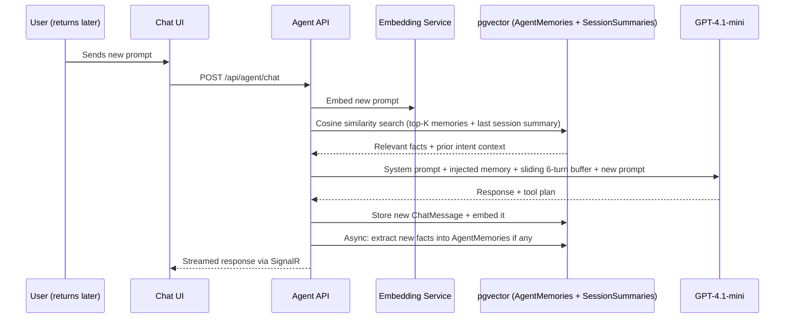

# Agentic AI Orchestrator & Tools (Backend)

**Derived from:** SRS v3.1 §6 (Agentic AI Ecosystem & Rate Limit Infrastructure)

## 1. Orchestrator & Specialized Tool Suite

- **Single Orchestrator Agent:** Built on Microsoft Agent Framework. Parses natural language requests, plans tool execution, and streams step-by-step reasoning traces to the React frontend via SignalR.
- **Human-in-the-Loop Guardrail:** Irreversible actions (e.g., final application submission, JD publish, bulk apply) require explicit UI button confirmation from the user — the backend must never auto-execute these; each corresponding endpoint only finalizes the action when explicitly called with a confirmed payload, never as a side effect of a chat response.

## 2. The 6 Agent Tools

| Agent / Tool | Credit Cost | Function |
|---|---|---|
| Job Search & Match Agent | 5 Credits | Queries listings and ranks them using the ATS Scoring Engine (and `JobEmbeddings` semantic search) |
| Application Autofill Agent | 10 Credits | Inspects dynamic `screening_questions` schema and profile data to draft structured answers for candidate review |
| Application Status Tool | 2 Credits | Performs lightweight DB lookups to report current applicant pipeline stages |
| Bulk Apply Agent | 10 Credits/App | Identifies jobs with an ATS Match Score ≥ 80% and generates batch application drafts requiring a single batch confirmation |
| JD Generation Agent (Recruiter) | 15 Credits | Drafts job description from recruiter brief |
| Candidate Screening Agent (Recruiter) | 5 Credits/candidate | Ranks/summarizes applicants against the JD |

Every tool implements a common `IAgentTool` interface and is registered via DI/assembly scanning — no orchestrator logic should be hardcoded per tool (see [09-backend-folder-structure.md](09-backend-folder-structure.md)).

## 3. Chat Session Rate Limiting

- The chatbot is limited to **one in-flight/running request per user session** — enforce this server-side (not just as a frontend UI affordance) so a second concurrent message for the same session is rejected or queued-rejected. This limit is independent of AI credit balance and exists to control concurrent API load/cost.

## 4. Interactive Autofill — Four-Phase Resolution Loop

The Application Autofill Agent executes a four-phase resolution loop when processing dynamic screening questions (`Jobs.screening_questions`):

1. **Auto-Resolution Phase:** Extracted profile and resume data are mapped to dynamic question definitions to pre-fill answers.
2. **Interactive Pause-and-Prompt Phase:** If required dynamic questions cannot be mapped to profile data, the agent halts auto-submission and returns an `unresolvedRequiredQuestions` list with natural-language guidance for the client-side prompt UI.
3. **Candidate Review & Inline Edit Phase:** All pre-filled answers (whether extracted by AI or provided during prompt resolution) are returned as an editable draft; if an answer is modified and the client indicates "save to profile," the backend persists the updated value back to `Users.profile`.
4. **Human-in-the-Loop Submission Phase:** The final application payload is only committed via `POST /api/applications` after the candidate's explicit "Confirm & Submit Application" — the autofill endpoints never submit an application themselves, only draft answers.

## 5. AI Credit & Context Guardrails

- **User Credit Quota:** 500 AI credits per rolling 30-day window (measured from each user's signup date). Deducted **only upon successful response** — implement via a single cross-cutting interceptor/decorator wrapping AI tool execution (`CreditDeductionInterceptor`), never scattered per-tool deduction logic.
- **Zero-Credit Behavior:** Blocked AI actions return the `CREDIT_EXHAUSTED` error code (429) so the frontend can surface its "Coming Soon" upgrade prompt. Manual (non-AI) job search and application flows remain 100% operational regardless of credit balance — never gate a non-AI endpoint behind credit checks.
- **Platform Rate Limit:** 150 daily GitHub Models requests enforced globally via a Redis token-bucket queue (10 req/min limit). Exceeding this cap returns the `AI_BUSY` error code (429) **without deducting user credits** — the rate-limit check must run **before** any LLM call is attempted, not after.
- **Context Size Limits:**
  - PDF/DOCX Resume Uploads hard capped at 1MB (enforced server-side regardless of client-side checks).
  - Resume Text Extraction truncated to 12,000 characters (~3,000 tokens) before prompt injection.
  - Chat Conversation Window maintained as a sliding buffer of the last 6 conversation turns (~2,000 tokens), augmented by pgvector top-K memory retrieval (see §7).

## 6. AI Disclaimer — Backend Responsibility

- The backend does not render the disclaimer (a frontend concern) but must ensure every AI-generated response payload is clearly identifiable as AI-generated so the frontend can attach the disclaimer consistently — e.g., chatbot responses, AI-drafted application answers, AI-generated job descriptions, AI-generated company descriptions, and AI match/ranking explanations should all be distinguishable in their response shape (already true given each has its own endpoint/response type).

## 7. Agent Memory & Vector DB Architecture (pgvector)

Chat continuity and cross-session intent understanding are powered by **pgvector** on the existing Supabase Postgres instance — no separate vector DB service is required.

### Entities

| Entity | Purpose | Key Columns |
|---|---|---|
| ChatMessages | Raw turn-by-turn log | id, conversation_id, user_id, role, content, token_count, created_at |
| ChatEmbeddings | Vector representation of each message for semantic recall | id, message_id (FK), embedding vector(1536), created_at |
| AgentMemories | Extracted durable facts/preferences (e.g., "prefers remote," "target role") | id, user_id, content, memory_type (FACT/PREF/GOAL), category, embedding vector(1536), source_message_id, confidence, created_at |
| SessionSummaries | Compressed episodic summary per conversation session | id, conversation_id, summary_text, embedding vector(1536), generated_at |
| ToolCallLogs | Every tool invocation (input/output/status) for explainability & re-grounding | id, conversation_id, step_number, tool_name, input jsonb, output jsonb, status, latency_ms, created_at |
| JobEmbeddings | Semantic vector index of job postings (title+description+requirements) | id, job_id (FK), embedding vector(1536), updated_at |
| ProfileEmbeddings | Semantic vector index of candidate profile + resume summary | id, user_id (FK), embedding vector(1536), updated_at |

### Retrieval-Augmented Intent Flow (Returning User)

### Design Rules

- Use HNSW index with `vector_cosine_ops` on all embedding columns for fast top-K retrieval.
- Standardize embedding dimension (1536) across all five embedding tables.
- Fact-extraction and session-summarization run as **async background jobs** (`FactExtractionWorker`, `SessionSummaryWorker`), not inline in the request path — never add this latency to the chat response.
- `JobEmbeddings`/`ProfileEmbeddings` upgrade the Job Search & Match tool from keyword-only to semantic + ATS-weighted scoring, and improve Candidate Screening quality.
- Only top-K relevant memories + last session summary are injected into the prompt — **never** full raw history — to protect token budget and inference quality.

## 8. AI Failure Handling

- If an AI agent call fails or times out before producing a usable result (LLM API error, timeout, or GitHub Models rate limit hit), the credit for that action is **not deducted** — deduction happens only after a successful response is returned to the user.
- On failure, return the `AI_GENERATION_FAILED` error code so the frontend shows a clear inline error rather than a silent failure.

## Implementation Checklist (Backend)

- [ ] Register Microsoft Agent Framework + `IAgentTool` interface; register all tools via DI/assembly scanning
- [ ] Implement Orchestrator Agent with NL intent parsing and tool-execution planning
- [ ] Stream step-by-step reasoning traces to the frontend via SignalR `AgentHub`
- [ ] Implement HITL confirmation gate for irreversible actions at the endpoint level (never auto-execute from chat)
- [ ] Implement Job Search & Match Agent (5 credits) using `AtsScoringService` + `JobEmbeddings` semantic search
- [ ] Implement Application Autofill Agent (10 credits) with the full four-phase resolution loop
- [ ] Implement Application Status Tool (2 credits) as a live DB lookup (not cached/stale)
- [ ] Implement Bulk Apply Agent (10 credits/app) with ATS ≥ 80% filter and single batch confirmation
- [ ] Implement JD Generation Agent (15 credits), always returning `requiresManualReview: true`
- [ ] Implement Candidate Screening Agent (5 credits/candidate) as suggestion-only (never mutates application status)
- [ ] Enforce one in-flight chatbot request per session server-side
- [ ] Enable pgvector extension on Supabase Postgres; create all 7 vector-memory entities with HNSW cosine indexes (dim 1536)
- [ ] Implement `EmbeddingService` (standardized 1536-dim, pluggable provider)
- [ ] Implement top-K cosine similarity retrieval (memories + last session summary) injected into the system prompt
- [ ] Implement async `FactExtractionWorker` and `SessionSummaryWorker` as hosted services
- [ ] Implement `CreditLedgerService` + `CreditDeductionInterceptor` (deduct only on success, single cross-cutting decorator)
- [ ] Implement Redis token-bucket rate limiter (10/min, 150/day) checked **before** any LLM call
- [ ] Implement `AI_BUSY` / `CREDIT_EXHAUSTED` / `AI_GENERATION_FAILED` error codes consistently across all AI endpoints
- [ ] Enforce 1MB resume/logo upload cap and 12,000-character resume text truncation server-side

## Integration Points (What the Frontend Consumes)

- SignalR `AgentHub` for streaming chat/reasoning traces (Redis backplane).
- `POST /api/agent/chat`, `POST /api/agent/autofill`, `POST /api/agent/bulk-apply`, `POST /api/agent/generate-jd`, `POST /api/agent/screen-candidates`
- `GET /api/credits/balance`

See [15-api-contracts-backend.md](15-api-contracts-backend.md) for exact shapes and error codes.
