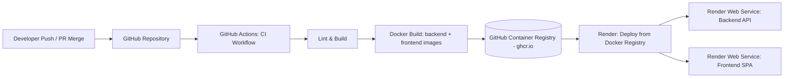

# CI/CD Pipeline (GitHub Actions + GHCR + Render)

**Derived from:** CI/CD Pipeline (GitHub Actions + GHCR + Render) — full document

> **CI runs on GitHub Actions. CD runs on Render.** The pipeline follows a Docker registry pattern: on every push/merge, backend and frontend images are built and pushed to the GitHub Container Registry (GHCR), and Render pulls the tagged image from GHCR to deploy — Render never builds from source directly. This file is the full pipeline; the Frontend knowledge base's `16-deployment-frontend.md` contains only a short stub pointing back here.

## 1. Pipeline Overview



**Flow summary:**

1. Developer pushes to `main` (or merges a PR into `main`).
2. GitHub Actions CI workflow triggers: checkout → build → (optional lint/test) → Docker build for backend and frontend.
3. Images are tagged and pushed to **GHCR** (`ghcr.io/<owner>/<repo>-backend`, `ghcr.io/<owner>/<repo>-frontend`).
4. Render is configured with each web service pointing at the corresponding GHCR image. A deploy is triggered (auto via Render's registry-watch, or explicitly via Render Deploy Hook/API call from the workflow).
5. Render pulls the newly pushed image tag and deploys it — no source build occurs on Render.

## 2. Repository & Registry Setup

- **Source control:** GitHub repository (mono-repo containing `/backend` and `/frontend`).
- **Container registry:** GitHub Container Registry (GHCR) — `ghcr.io/<github-org-or-username>/<image-name>`.
- **Registry authentication:** GitHub Actions authenticates to GHCR using the built-in `GITHUB_TOKEN` (no extra PAT needed for same-repo push), with `packages: write` permission granted to the workflow.
- **Image visibility:** Images pushed to GHCR must be set to a visibility level (public or private) that Render can pull from. If private, Render must be given a GHCR **read** credential (Personal Access Token with `read:packages` scope) as a Registry Credential in Render's dashboard.
- **Two images per deploy:** one for the backend (ASP.NET Core API) and one for the frontend (React SPA served via Nginx inside the container).

## 3. Dockerfiles

### 3.1 Backend Dockerfile (`/backend/Dockerfile`)

```dockerfile
# ---- Build Stage ----
FROM mcr.microsoft.com/dotnet/sdk:9.0 AS build
WORKDIR /src
COPY . .
RUN dotnet restore JobPortal.sln
RUN dotnet publish src/JobPortal.Api/JobPortal.Api.csproj -c Release -o /app/publish

# ---- Runtime Stage ----
FROM mcr.microsoft.com/dotnet/aspnet:9.0 AS runtime
WORKDIR /app
COPY --from=build /app/publish .
EXPOSE 8080
ENV ASPNETCORE_URLS=http://+:8080
ENTRYPOINT ["dotnet", "JobPortal.Api.dll"]
```

### 3.2 Frontend Dockerfile (`/frontend/Dockerfile`) — Reference Only

The frontend owns this file; reproduced here for pipeline completeness:

```dockerfile
FROM node:20-alpine AS build
WORKDIR /app
COPY package*.json ./
RUN npm ci
COPY . .
RUN npm run build

FROM nginx:alpine AS runtime
COPY --from=build /app/dist /usr/share/nginx/html
COPY nginx.conf /etc/nginx/conf.d/default.conf
EXPOSE 80
CMD ["nginx", "-g", "daemon off;"]
```

## 4. GitHub Actions Workflows

### 4.1 Backend CI/CD Workflow (`.github/workflows/backend-ci-cd.yml`)

```yaml
name: Backend CI/CD

on:
  push:
    branches: [main]
    paths:
      - 'backend/**'
      - '.github/workflows/backend-ci-cd.yml'

permissions:
  contents: read
  packages: write

env:
  REGISTRY: ghcr.io
  IMAGE_NAME: ${{ github.repository }}-backend

jobs:
  build-and-push:
    runs-on: ubuntu-latest
    steps:
      - name: Checkout repository
        uses: actions/checkout@v4

      - name: Set up .NET
        uses: actions/setup-dotnet@v4
        with:
          dotnet-version: '9.0.x'

      - name: Restore & Build
        working-directory: ./backend
        run: |
          dotnet restore JobPortal.sln
          dotnet build JobPortal.sln -c Release --no-restore

      - name: Log in to GitHub Container Registry
        uses: docker/login-action@v3
        with:
          registry: ${{ env.REGISTRY }}
          username: ${{ github.actor }}
          password: ${{ secrets.GITHUB_TOKEN }}

      - name: Extract metadata (tags)
        id: meta
        uses: docker/metadata-action@v5
        with:
          images: ${{ env.REGISTRY }}/${{ env.IMAGE_NAME }}
          tags: |
            type=sha,format=short
            type=raw,value=latest,enable={{is_default_branch}}

      - name: Build and push Docker image
        uses: docker/build-push-action@v5
        with:
          context: ./backend
          file: ./backend/Dockerfile
          push: true
          tags: ${{ steps.meta.outputs.tags }}
          labels: ${{ steps.meta.outputs.labels }}

      - name: Trigger Render deploy
        run: |
          curl -X POST "${{ secrets.RENDER_BACKEND_DEPLOY_HOOK }}"
```

### 4.2 Frontend CI/CD Workflow (`.github/workflows/frontend-ci-cd.yml`)

```yaml
name: Frontend CI/CD

on:
  push:
    branches: [main]
    paths:
      - 'frontend/**'
      - '.github/workflows/frontend-ci-cd.yml'

permissions:
  contents: read
  packages: write

env:
  REGISTRY: ghcr.io
  IMAGE_NAME: ${{ github.repository }}-frontend

jobs:
  build-and-push:
    runs-on: ubuntu-latest
    steps:
      - name: Checkout repository
        uses: actions/checkout@v4

      - name: Set up Node.js
        uses: actions/setup-node@v4
        with:
          node-version: '20'
          cache: 'npm'
          cache-dependency-path: frontend/package-lock.json

      - name: Install & Build
        working-directory: ./frontend
        run: |
          npm ci
          npm run build

      - name: Log in to GitHub Container Registry
        uses: docker/login-action@v3
        with:
          registry: ${{ env.REGISTRY }}
          username: ${{ github.actor }}
          password: ${{ secrets.GITHUB_TOKEN }}

      - name: Extract metadata (tags)
        id: meta
        uses: docker/metadata-action@v5
        with:
          images: ${{ env.REGISTRY }}/${{ env.IMAGE_NAME }}
          tags: |
            type=sha,format=short
            type=raw,value=latest,enable={{is_default_branch}}

      - name: Build and push Docker image
        uses: docker/build-push-action@v5
        with:
          context: ./frontend
          file: ./frontend/Dockerfile
          push: true
          tags: ${{ steps.meta.outputs.tags }}
          labels: ${{ steps.meta.outputs.labels }}

      - name: Trigger Render deploy
        run: |
          curl -X POST "${{ secrets.RENDER_FRONTEND_DEPLOY_HOOK }}"
```

> Each workflow is path-scoped (`paths: backend/**` / `frontend/**`) so a change to one service does not trigger an unnecessary rebuild/deploy of the other.

### 4.3 Pull Request Validation Workflow (`.github/workflows/pr-validation.yml`)

```yaml
name: PR Validation

on:
  pull_request:
    branches: [main]

jobs:
  backend-build:
    runs-on: ubuntu-latest
    steps:
      - uses: actions/checkout@v4
      - uses: actions/setup-dotnet@v4
        with:
          dotnet-version: '9.0.x'
      - working-directory: ./backend
        run: |
          dotnet restore JobPortal.sln
          dotnet build JobPortal.sln -c Release --no-restore

  frontend-build:
    runs-on: ubuntu-latest
    steps:
      - uses: actions/checkout@v4
      - uses: actions/setup-node@v4
        with:
          node-version: '20'
      - working-directory: ./frontend
        run: |
          npm ci
          npm run build
```

> No automated test suite exists per stated scope; PR validation is therefore limited to restore/build success on both tracks.

## 5. Render Deployment Configuration

Render is configured to deploy from a **Docker registry image**, not from a connected Git repo build.

### 5.1 Backend Web Service

| Setting | Value |
|---|---|
| Deploy method | Existing Image / Docker Registry |
| Image URL | `ghcr.io/<owner>/<repo>-backend:latest` |
| Registry credentials | GitHub PAT with `read:packages` (if image is private) |
| Port | `8080` |
| Auto-Deploy | Enabled on new image push (or triggered via Deploy Hook from CI) |
| Environment | Production environment variables (Section 6) |

### 5.2 Frontend Web Service

| Setting | Value |
|---|---|
| Deploy method | Existing Image / Docker Registry |
| Image URL | `ghcr.io/<owner>/<repo>-frontend:latest` |
| Registry credentials | GitHub PAT with `read:packages` (if image is private) |
| Port | `80` |
| Auto-Deploy | Enabled on new image push (or triggered via Deploy Hook from CI) |
| Environment | `VITE_API_BASE_URL` pointing to the deployed backend service |

### 5.3 Deploy Hooks

Each Render service exposes a unique Deploy Hook URL, stored as a GitHub Actions secret (`RENDER_BACKEND_DEPLOY_HOOK`, `RENDER_FRONTEND_DEPLOY_HOOK`) and called via `curl` at the end of the respective workflow.

## 6. Environment Variables & Secrets

| Secret / Variable | Location | Purpose |
|---|---|---|
| `GITHUB_TOKEN` | GitHub Actions (built-in) | Authenticate & push images to GHCR |
| `RENDER_BACKEND_DEPLOY_HOOK` | GitHub Actions secret | Trigger backend redeploy on Render |
| `RENDER_FRONTEND_DEPLOY_HOOK` | GitHub Actions secret | Trigger frontend redeploy on Render |
| `LLM_API_KEY` (GitHub Models) | Render backend service env var | Server-side only, never in frontend bundle |
| `JWT_SIGNING_SECRET` | Render backend service env var | Server-side only, never in frontend bundle |
| `DATABASE_CONNECTION_STRING` | Render backend service env var | Supabase PostgreSQL connection |
| `REDIS_URL` | Render backend service env var | Rate limiting + SignalR backplane |
| `SUPABASE_STORAGE_KEY` | Render backend service env var | Resume/logo upload storage |
| `VITE_API_BASE_URL` | Render frontend service env var | Points frontend to deployed backend URL |

## 7. Versioning & Tagging Strategy

- Every push to `main` produces two image tags per service: a short commit SHA tag (e.g., `sha-a1b2c3d`) and a rolling `latest` tag.
- `latest` is what Render is configured to pull for standard deploys.
- The SHA tag provides an immutable, addressable image for manual rollback without depending on `latest` having moved.

## 8. Rollback Procedure

1. Identify the last known-good commit SHA tag from the GHCR package history (`ghcr.io/<owner>/<repo>-backend:sha-<good-sha>`).
2. In the Render dashboard, update the service's Image URL to the specific SHA tag instead of `latest`.
3. Manually trigger a redeploy from that pinned tag.
4. Once verified stable, either continue pinning to that SHA or push a fixed commit to `main` to restore normal `latest`-based flow.

## Implementation Checklist

- [ ] Add `/backend/Dockerfile` (multi-stage: SDK build → ASP.NET runtime)
- [ ] Add `/frontend/Dockerfile` (multi-stage: Node build → Nginx runtime) + `nginx.conf` (frontend-owned, referenced here)
- [ ] Create `.github/workflows/backend-ci-cd.yml` with path filter on `backend/**`
- [ ] Create `.github/workflows/frontend-ci-cd.yml` with path filter on `frontend/**`
- [ ] Create `.github/workflows/pr-validation.yml` for restore/build checks on PRs
- [ ] Grant workflow `packages: write` permission for GHCR push
- [ ] Confirm images publish to `ghcr.io/<owner>/<repo>-backend` and `ghcr.io/<owner>/<repo>-frontend`
- [ ] Set GHCR package visibility and, if private, generate a `read:packages` PAT for Render
- [ ] Create Render backend Web Service configured as "Deploy from Existing Image / Docker Registry"
- [ ] Create Render frontend Web Service configured as "Deploy from Existing Image / Docker Registry"
- [ ] Add Render Deploy Hook URLs as GitHub Actions secrets
- [ ] Configure all backend environment variables/secrets directly in Render (never in the frontend image)
- [ ] Configure `VITE_API_BASE_URL` in the Render frontend service pointing to the backend service URL
- [ ] Verify end-to-end: push to `main` → image built → pushed to GHCR → Render deploy triggered → live URL updated
- [ ] Document rollback steps (Section 8) in the repository README for demo-day safety
